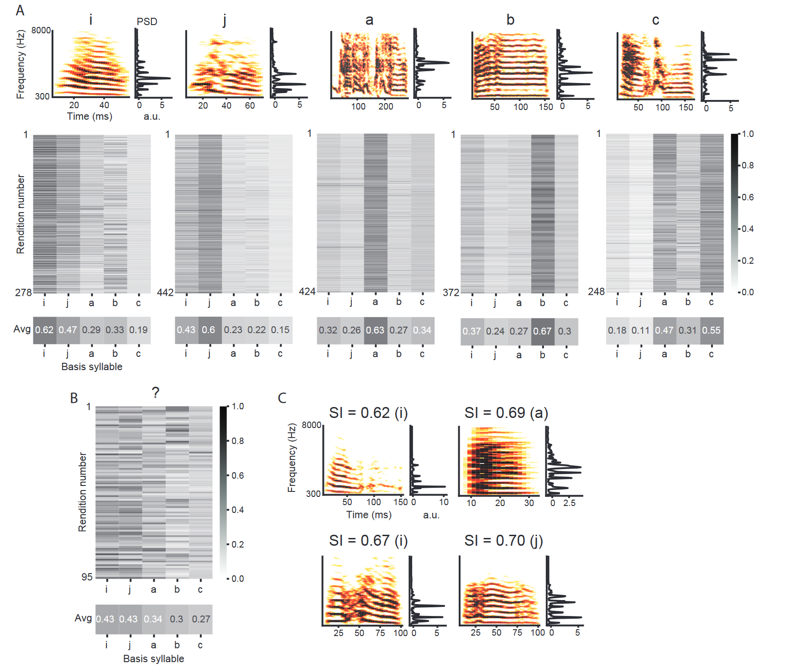

# syllable similiarity

- Code for analyzing spectral similarity between a pair of song syllables by using power spectral densities.

- SI (similarity index) denotes columnal average of the matching syllable in the similarity matrix

- Plots song spectrograms & similarity heatmaps

- Results published in _Current Biology_ ([Moorman et al., 2021](https://www.sciencedirect.com/science/article/pii/S0960982221005431))

